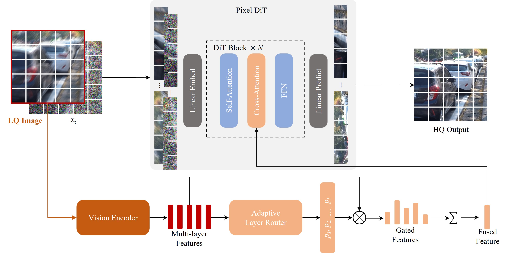

<div align="center">


<h2>PixRestore: Unified Image Restoration via Pixel Diffusion Transformer</h2>


<a href='https://arxiv.org/pdf/2608.16793'></a> <a href='https://csslc.github.io/pixrestore-page/'></a>


[Lingchen Sun](https://scholar.google.com/citations?hl=zh-CN&tzom=-480&user=ZCDjTn8AAAAJ)<sup>1,2</sup>
| [Rongyuan Wu](https://scholar.google.com/citations?user=A-U8zE8AAAAJ&hl=zh-CN)<sup>1,2</sup> | 
[Xiangtao Kong](https://scholar.google.com/citations?hl=zh-CN&user=lueNzSgAAAAJ&view_op=list_works&sortby=pubdate)<sup>1,2</sup> |
[Jixin Zhao](https://scholar.google.com/citations?user=0Z89rfUAAAAJ)<sup>1,2</sup> |
[Qiaosi Yi](https://scholar.google.com/citations?user=y5bqy0AAAAAJ&hl=zh-CN)<sup>1,2</sup> 

[Yujing Sun](https://scholar.google.com/citations?user=kj3VUSwAAAAJ&hl=en)<sup>1,2</sup> |
[Shuaizheng Liu](https://scholar.google.com/citations?user=wzdCc-QAAAAJ&hl=zh-CN)<sup>1,2</sup> |
[Zhengqiang Zhang](https://scholar.google.com/citations?user=UX26wSMAAAAJ&hl=en)<sup>1,2</sup> | 
[Lei Zhang](https://www4.comp.polyu.edu.hk/~cslzhang)<sup>1,2</sup>

<sup>1</sup>The Hong Kong Polytechnic University, <sup>2</sup>OPPO Research Institute
</div>


## ⏰ Update
- **2026.8.17**: Code and models are released.

:star: If PixRestore is helpful to your images or projects, please help star this repo. Thanks! :hugs:

## 🌟 Overview Framework


**We formulate UIR as a conditional flow matching problem in pixel space.**

(1) A VAE-free pixel DiT learns the conditional flow directly on RGB pixels, avoiding the lossy compression of a latent autoencoder. 

(2) To capture both degradation and semantic cues, we use a vision encoder to extract multi-layer dense features from the LQ image, and use an adaptive layer router to predict per-layer weights $p_l$. These weights fuse the features into a single representation, which is injected into the DiT blocks by cross-attention. In addition, the predicted weights enable hierarchical visual supervision, detailed in Sec. 3.2 of the paper. 

(3) For efficient inference, we finetune a single-step generator from the multi-step model via DINO-based adversarial objectives.

## ⚙ Dependencies and Installation
```shell
## git clone this repository
git clone https://github.com/csslc/PixRestore.git
cd PixRestore


# create an environment
conda create -n PixRestore
python=3.10 -y
conda activate PixRestore
pip install --upgrade pip
pip install -r requirements.txt
```

## 🍭 Quick Inference
#### Step 1: Download the pretrained models
Download the PixRestore model from [`obox`]( https://sbox.myoas.com/l/Ba05f09268ea6081a)(pwd: PixRestore824).

DINOv2 is downloaded from Meta's official torch hub on first use. For offline
machines, clone [facebookresearch/dinov2](https://github.com/facebookresearch/dinov2)
and pass a local repository and/or checkpoint:

```
--dinov2-repository /path/to/dinov2 \
--dinov2-checkpoint /path/to/dinov2_vits14_pretrain.pth
```


The same fields can be set in `configs/train.yaml`.

#### Step 2: Running testing command 
  ```bash
  CUDA_VISIBLE_DEVICES=0,1,2,3,4,5,6,7 \
accelerate launch \
  --multi_gpu \
  --num_processes 8 \
  inference.py \
  --config configs/train.yaml \
  -c /path/to/checkpoint \
  -i /path/to/image_or_folder \
  -o outputs/restored \
  --test-mode center_crop \
  --infer-steps 1 \
  --cfg-scale 1.0 \
  --method pixrestore \
  --seed 0
  ```

The "--input" argument can be set to an LQ image, an LQ image folder or a Json file in the following format.

```
{"type": degradation, "data": dataset_name, "lq": "/path/to/input.png", "gt": "/path/to/target.png"}.
```

## 🚋 Train
#### Step1: Prepare training data
Prepare the JSON file in the following format. Different Json files can be provided. During training, each file is sampled with the same sampling ratio.

```
{"lq": "/path/to/input.png", "gt": "/path/to/target.png"}.
```

#### Step2: Train Model
```bash
NUM_PROCESSES=8 bash scripts/train.sh \
  --manifest data/source_a.jsonl data/source_b.jsonl \
  --test-lq-dir data/validation/lq \
  --test-gt-dir data/validation/gt \
  --output-dir outputs/experiment
```

For DINO-GAN finetuning, use the GAN config and an optional pretrained model:

```bash
CONFIG=configs/train_gan.yaml NUM_PROCESSES=8 bash scripts/train.sh \
  --manifest data/source_a.jsonl data/source_b.jsonl \
  --pretrained /path/to/checkpoint \
  --output-dir outputs/gan_experiment
```

Run both self-contained CPU checks before a full training job. They create
temporary paired images and do not download DINO weights:

```bash
bash scripts/verify_standard.sh
bash scripts/verify_gan.sh
```

### Citations

If our code helps your research or work, please consider citing our paper.
The following are BibTeX references:

```
@article{sun2026pixrestore,
  title={PixRestore: Unified Image Restoration via Pixel Diffusion Transformer},
  author={Sun, Lingchen and Wu, Rongyuan and Kong, Xiangtao and Zhao, Jixin and Yi, Qiaosi and Sun, Yujing and Liu, Shuaizheng and Zhang, Zhengqiang and Zhang, Lei},
  journal={arXiv preprint arXiv: https://arxiv.org/pdf/2608.16793},
  year={2026}
}
```


### License
This project is released under the [Apache 2.0 license](LICENSE).

### Acknowledgement
This project is based on [VOSR](https://github.com/cswry/VOSR), [LightningDIT](https://github.com/hustvl/lightningdit), and [JiT](https://github.com/LTH14/JiT). Thanks for the awesome works. 

### Contact
If you have any questions, please contact: ling-chen.sun@connect.polyu.hk


<details>
<summary>statistics</summary>


</details>
